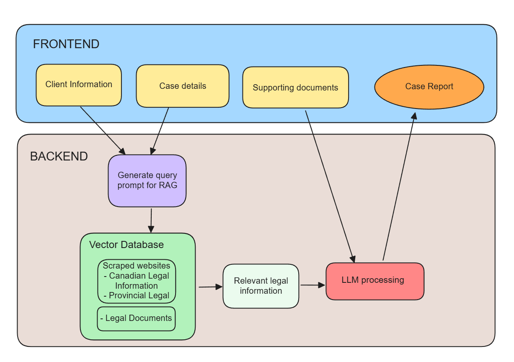

# Court AI

Welcome to Court AI, an application developed for Brave's Accelerate AI Hackathon by Team 6. Our mission is to assist regular citizens with complicated legal matters through the power of artificial intelligence.

## Project Overview

Court AI is designed to provide users with accessible and understandable legal assistance. Whether you are dealing with contracts, legal disputes, or need general legal advice, Court AI is here to help.

## Features

- **Legal Document Analysis**: Upload legal documents and receive a detailed analysis.
- **Legal Advice**: Get AI-powered advice on various legal matters.
- **User-Friendly Interface**: Easy to navigate and use, even for those without legal expertise.

## Architecture

## How to use

**Run the frontend locally**

`cd FRONTEND`,   go to FRONTEND directory

`npm install`,   install the relevant packages

`npm start`,   start the react app

**Connect to python backend via Flask API**

`pip install -r requirements.txt`, install necessary python packages

`python app.py`, run the flask app

## Demo Video

Check out our demo video: [https://youtu.be/vO6WTkogQYQ](https://youtu.be/vO6WTkogQYQ)

## License

This project is licensed under the MIT License. See the [LICENSE](LICENSE) file for more details.

## Contact

For any questions or inquiries, please contact us at johnfengphd@gmail.com